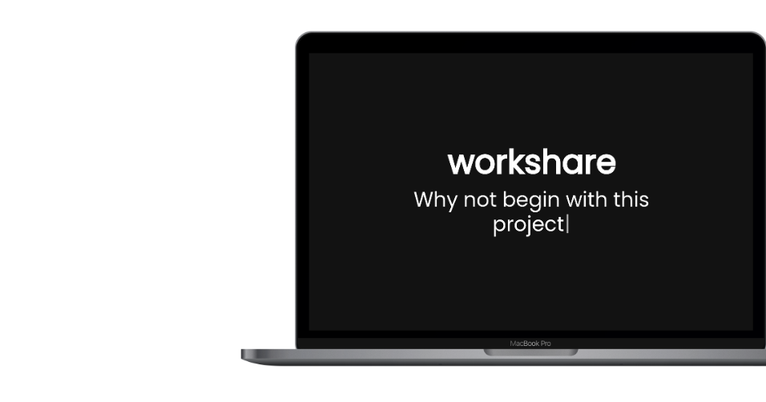
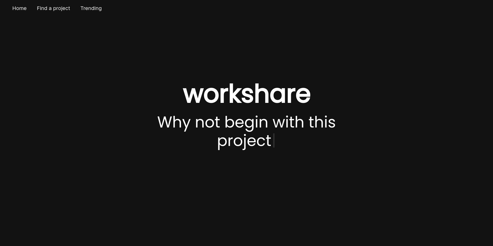
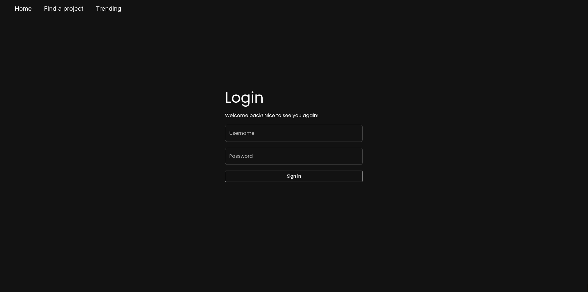
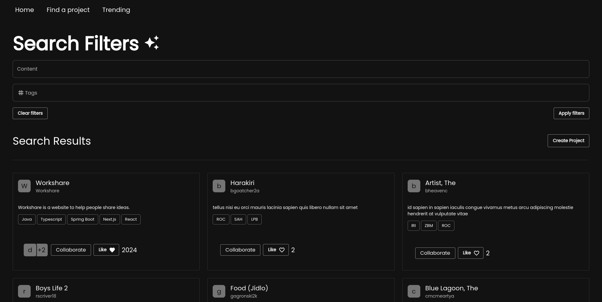
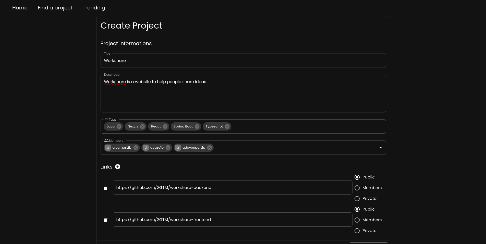
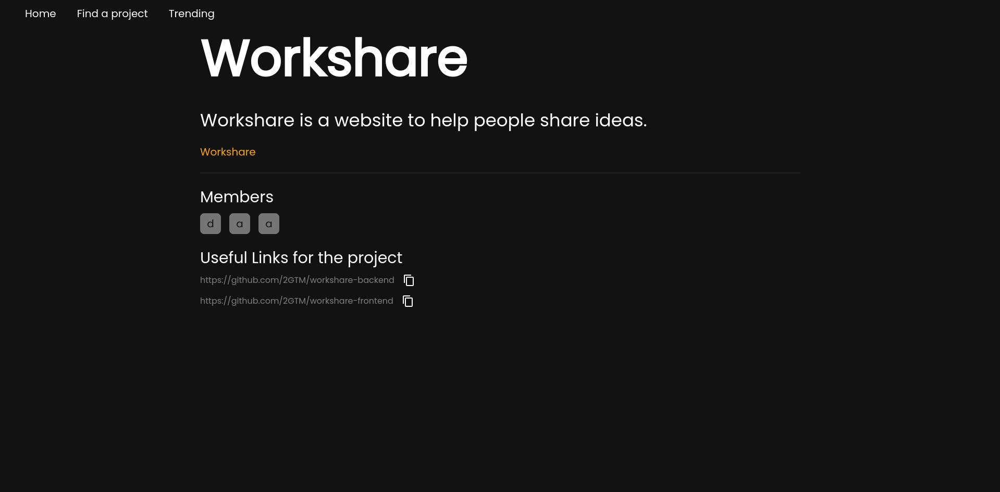
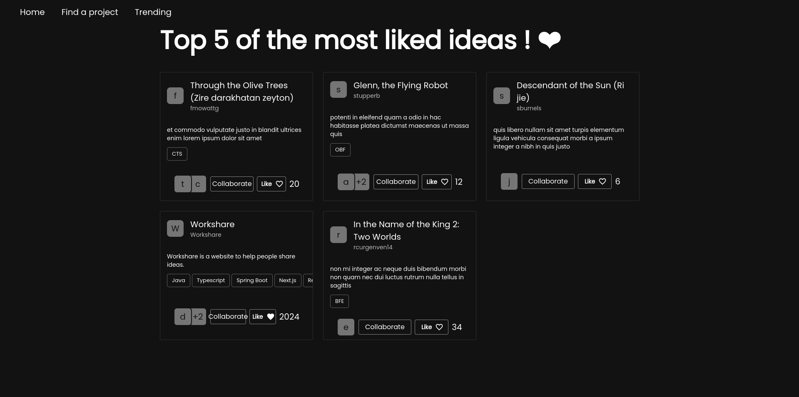
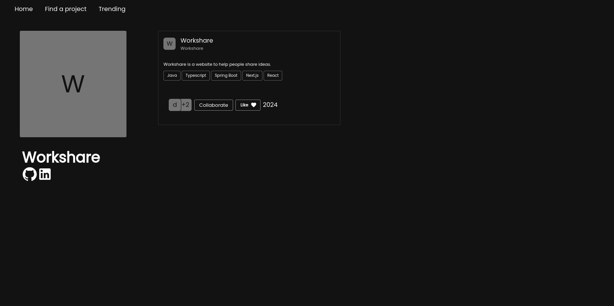

# Workshare

Workshare is a website that let people share their project idea. We built Workshare during the Hack your portfolio hackathon by MLH.



## Authors

- [@guettafa](https://www.github.com/guettafa)
- [@AchrafGroiez](https://github.com/AchrafGroiez)
- [@QuocDungTran380](https://github.com/QuocDungTran380)

## Features

- TO DO

## Technologies

### Frontend

- Typescript
- React
- Next.js
- Axios
- MUI

### Backend

- Java
- Spring Boot
- Maven
- Lombok

## Installation
<!-- Dependencies -->
<details open><summary><b>External dependencies</b></summary>
<br />

- [nodejs](https://nodejs.org/en/download/prebuilt-installer)
- [MariaDB](https://mariadb.org/download/)
- [JDK 17](https://www.oracle.com/ca-en/java/technologies/downloads/#java17)

</details>

<!-- Frontend section -->
<details open><summary><b>Frontend</b></summary>
<br />

Setup :

```sh
git clone https://github.com/2GTM/workshare-frontend
cd workshare-frontend/
npm install
```

Create a file named `config.json` in the root folder with this content :

```json
{
  "backendUrl" : "$BACKEND_URL"
}
```

</details>

<!-- Backend section -->
<details open><summary><b>Backend</b></summary>
<br />

Setup :

```sh
git clone https://github.com/2GTM/workshare-backend
cd workshare-backend
mvn install
```

Create a file named `env.properties` in the root folder with this content :

```properties
# Server Port
PORT=

# Database information
URL=jdbc:mariadb://localhost:3306/workshare
DB_USERNAME=
DB_PASSWORD=

# URL of the frontend
ALLOWED_URL=

# Secret key for JWT.
SECRET_JWT_KEY=
```

</details>

## Run the project

```sh
# Frontend
npm run dev

# Backend
mvn spring-boot:run
```

## Preview

### Home



### Login



### Search project



### Create project



### Project view



### Trending



### User profile


